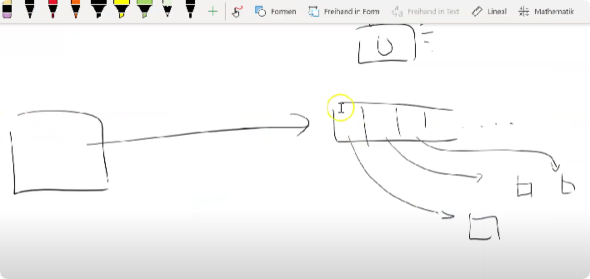

Games Setup:

https://www.youtube.com/watch?v=dolTEfF-mYA

Games - Rectangle 1:

https://www.youtube.com/watch?v=uoJDfaY_o5I

Games - Rectangle Diagonal:

https://www.youtube.com/watch?v=bwQ-7MdzGJQ
Problem:

Wenn sich ein Objekt alles merken muss wird das irgendwann nicht mehr kontrollierbar

Füge nochmal 10 Objekte dazu....das ist fast unmöglich

Lösung:

Erstelle Objekte die sich selbst rendern und bewegen

Make Objects 04:

DEMO

Erstelle ein Rechteck, einen Kreis und ein Oval.

Die Objekte sollen sich folgendermaßen bewegen:

https://www.youtube.com/watch?v=t7v8cIyf1Fk&feature=youtu.be

https://www.youtube.com/watch?v=unPHanEyxEQ&feature=emb_title

Wenn man viele Objekte einfügen will benötigt man eine Datenstruktr...ein Array, eine Liste, ein Set o.ä.

Lists 1:

https://www.youtube.com/watch?v=lBKKoLB_zbQ

Lists 2:

https://www.youtube.com/watch?v=C5tojfO9G-o

Interfaces:

https://www.youtube.com/watch?v=0o9MeiONTno

ImageActor:

https://www.youtube.com/watch?v=p6GKJuAmZZM

User Input:

https://www.youtube.com/watch?v=L4xm9wjNUiQ

Aufgabe 07 

Programmiere das Beispiel aus den Videos nach!

Mache folgende Adaptierungen

Es gibt 10 Rectangles

Es gibt 10 Circles

Es gibt 10 Eclipsen (müssen wieder herinfliegen)

Baue folgende Objekte dazu:

Baue die Rectangles so um, damit man im Konstruktor angeben kann ob sie von links nach rechts oder umgekehrt fliegen.

Die Circles sollen im laufe des Fluges wachsen - immer größer werden (der Durchmesser wächst) 
