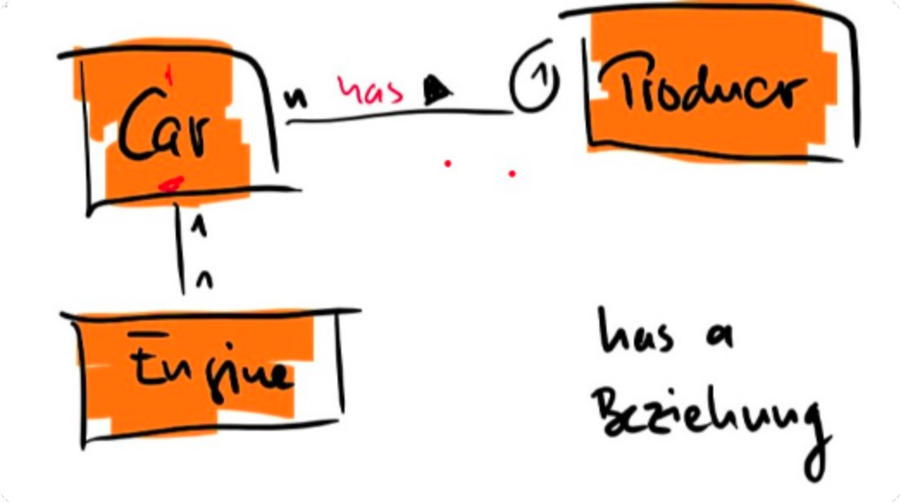
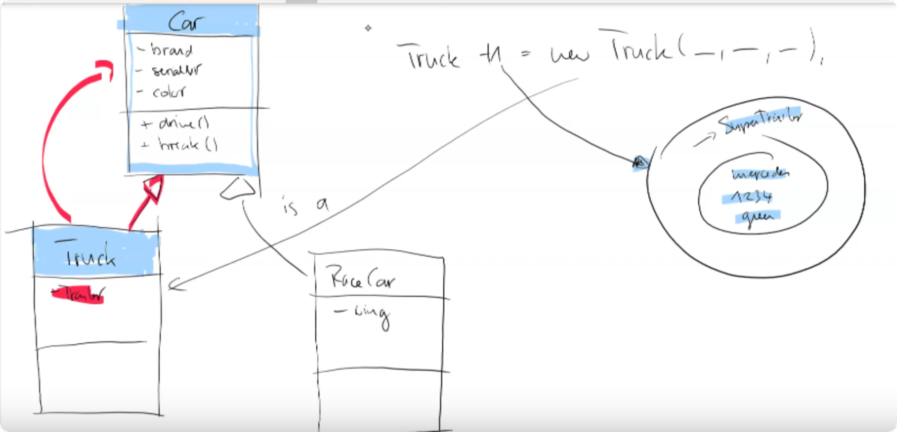
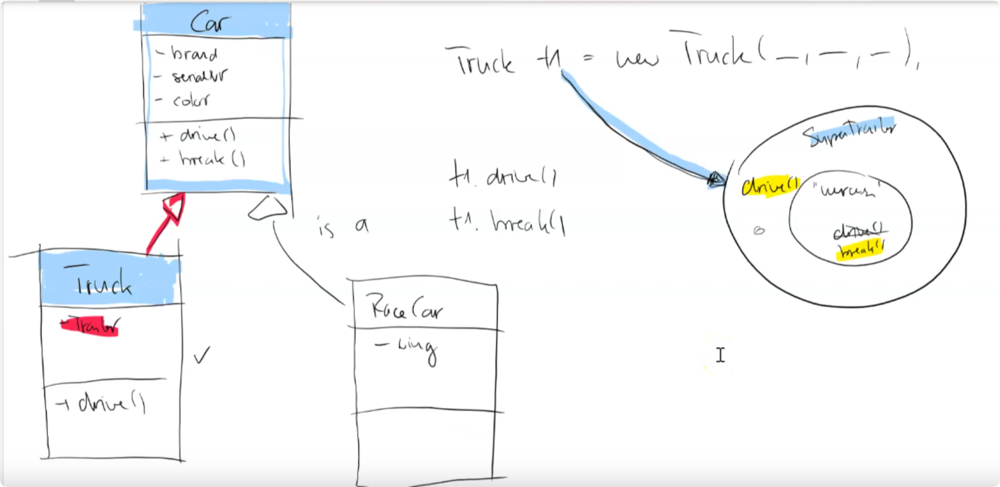

Mache ein neues Package at.xxx.examples.cars und implementiere folgende Aufgabenstellung (Achtung - neues Programm - nicht das alte Car Beispiel weiterverwenden)

Ein Auto hat eine Farbe, eine Maximalgeschwindigkeit, einen Basispreis, Basisverbrauch und einen Hersteller und einen Motor.  Der Hersteller hat einen Namen und ein Herkunftsland. Jeder Hersteller gibt einen gewissen Rabatt. Dieser ist unterschiedlich je nach Hersteller. Der Rabatt wird in Prozent angegeben. Der Motor ist entweder Diesel oder Benzin und hat eine Leistung.

Der Preis berechnet sich durch den Abzug des Rabatts vom Basispreis.

Der Benzinverbrauch entspricht die ersten 50.000km dem Basisverbrauch. Danach wird er um 9.8 Prozent höher. 

Video Vererbung:
https://www.youtube.com/watch?v=bHANXiJe3gs

Inheritance Override:
https://www.youtube.com/watch?v=_UkCiFg0MlQ

