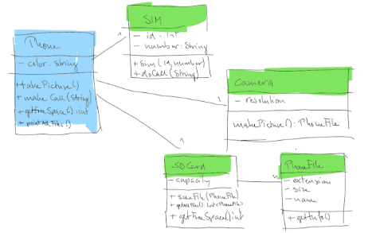
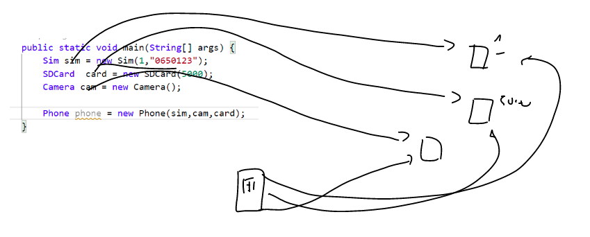
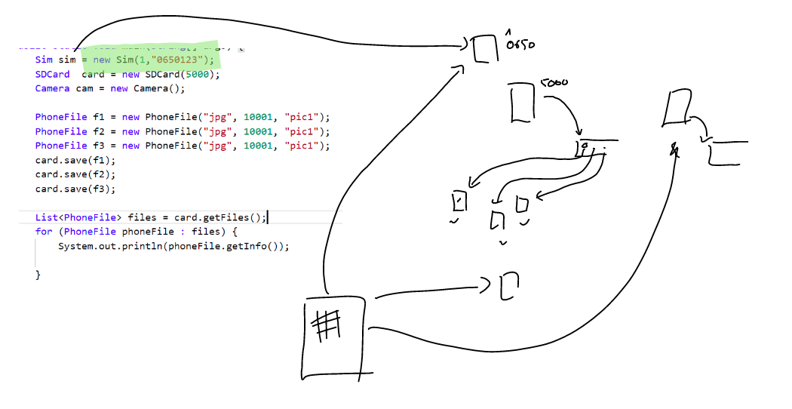

Wir bauen ein modulares Handy, bei dem diverse Komponenten getauscht werden können.

Ein Handy hat einen eine Kamera, eine Sim-Karte und eine Speicherkarte. Auf der Speicherkarte können Files gespeichert
werden. Die Komponenten können ausgetauscht werden. Die id und die Telefonnummer der Sim Karte können nicht geändert
werden.

Wenn ein Photo gemacht wird - gibt das Telefon die Aufforderung an die Kamera weiter - diese liefert das Photofile
zurück und das Telefon muss das File auf die SD-Karte speichern. Fotos können nur gemacht werden, wenn noch genug freier
Platz zur Verfügung steht. Je nach Resolution der Kamera werden die Files größer oder kleiner.

Erweiterungen: Gib alle Files der Speicherkarte aus. Füge ein Login fürs Handy ein.

Aus <https://lernen.digitalcampusvorarlberg.at/mod/page/view.php?id=5097>

CC_Phone

