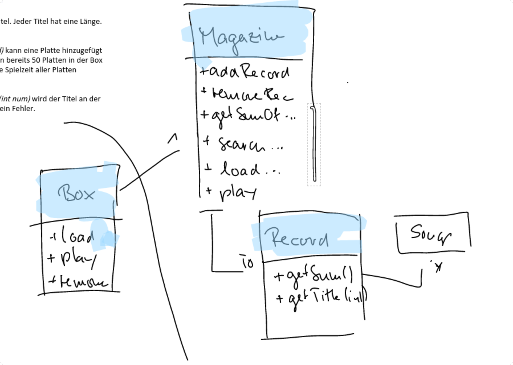

20 Musicbox

Eine Musikbox hat mehrere Schallplatten eingesteckt. Jede Schallplatte hat mehrere Titel. Jeder Titel hat eine Länge.
Schallplatten haben einen Plattentitel und eine id.

Die Musikbox kann 50 Platten beinhalten. Über die Funktion addRecord(Record record) kann eine Platte hinzugefügt werden.
Über removeRecord(Record record) wird eine Schallplatte ausgeworfen. Wenn bereits 50 Platten in der Box sind kommt eine
Fehlermeldung. Über die Funktion getSumOfMusic() wird die gesamte Spielzeit aller Platten ausgegeben. Über searchRecord(
String title) kann eine Platte gesucht werden.

Mit der Methode loadRecord(Record) wird eine Platte in den Spieler gelegt. Über play(int num) wird der Titel an der
Stelle num abgespielt (sysout). Wird play gestartet ohne eine Platte im Spieler kommt ein Fehler.

Überlege Dir sinnvolle Klassen! Wenn möglich, zeichne ein UML Diagramm.

[Video GIT Intellij](https://www.youtube.com/watch?hd=1&v=HwUMspfmeFY&feature=youtu.be)

[Video Musicbox Lösung](https://www.youtube.com/watch?v=L1Ylbc4lPuc)

