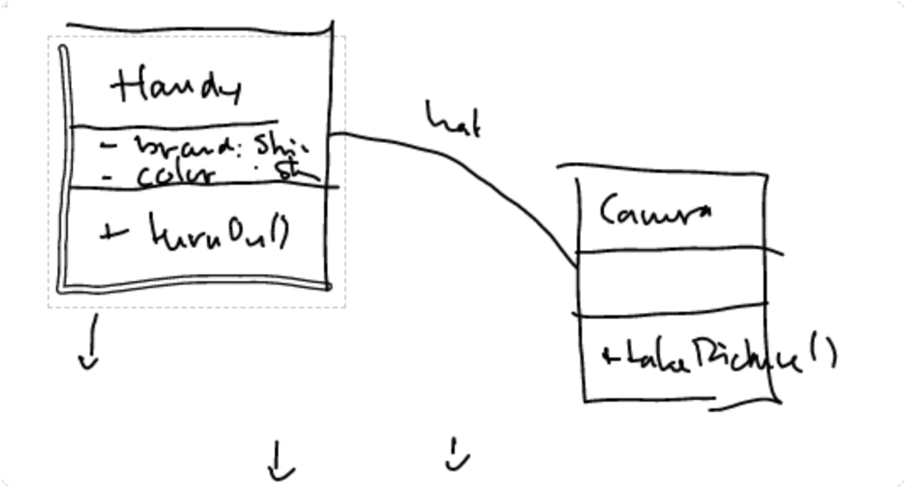
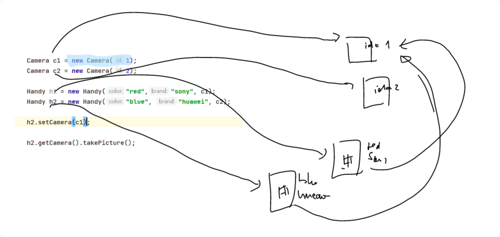

Handy besitzt Variablen brand color und die Funktion turnOn() die vor allem aufgerufen wird oder so. 
Das Handy hat eine Camera. Diese besitzt einen ID einen Preis und hat die Funktion takePicture();

